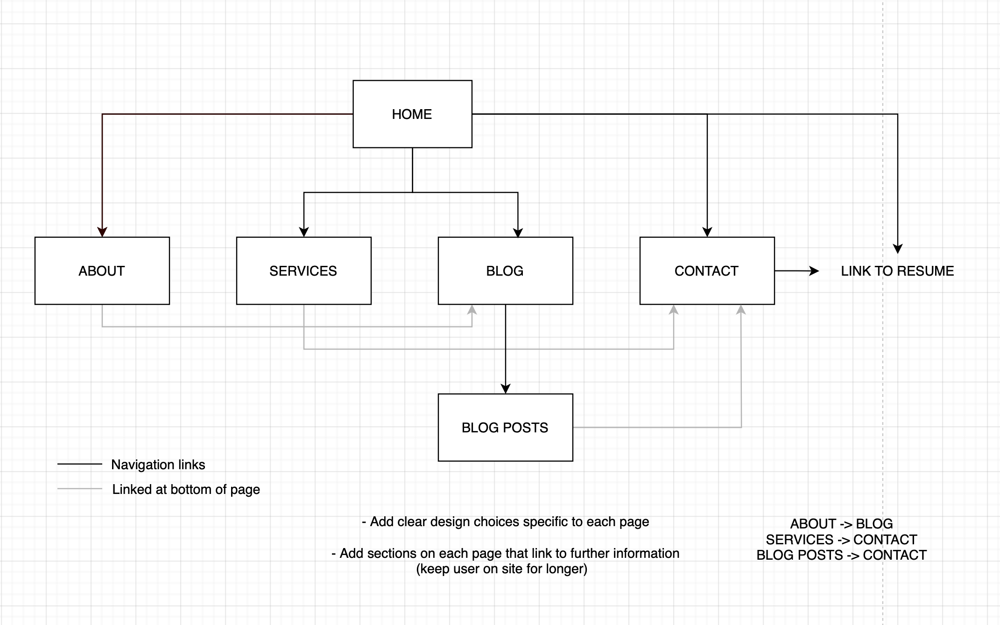
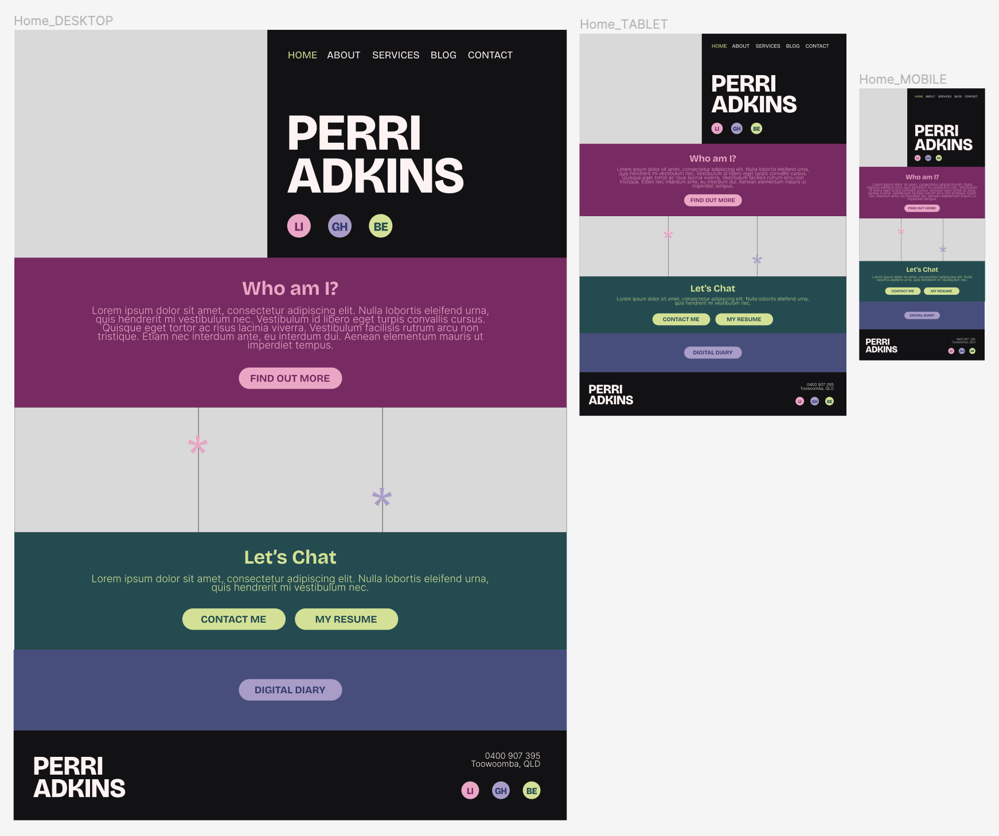
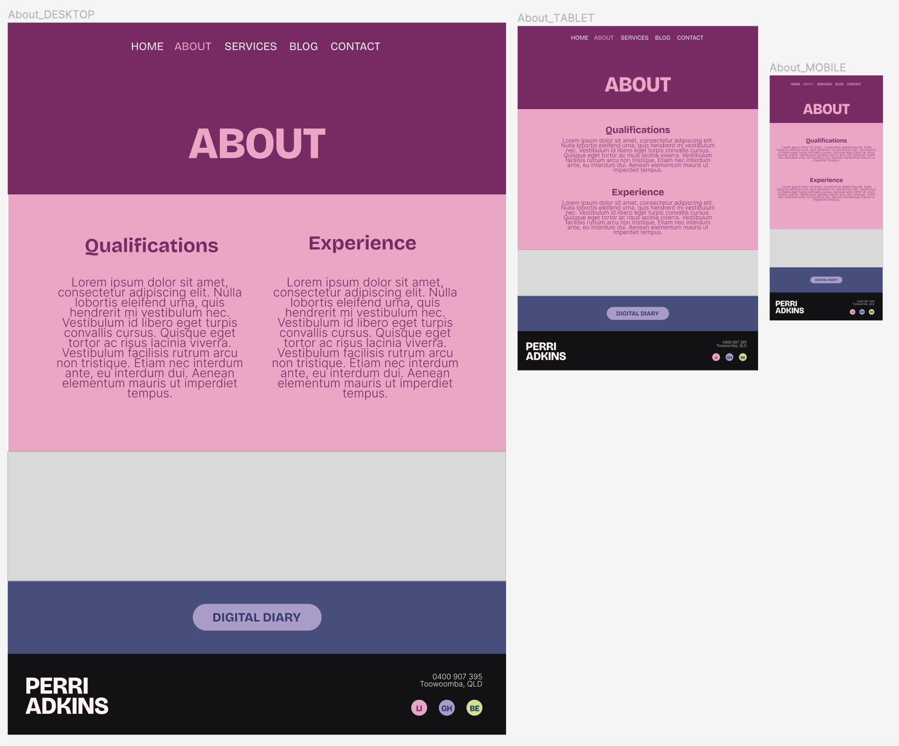
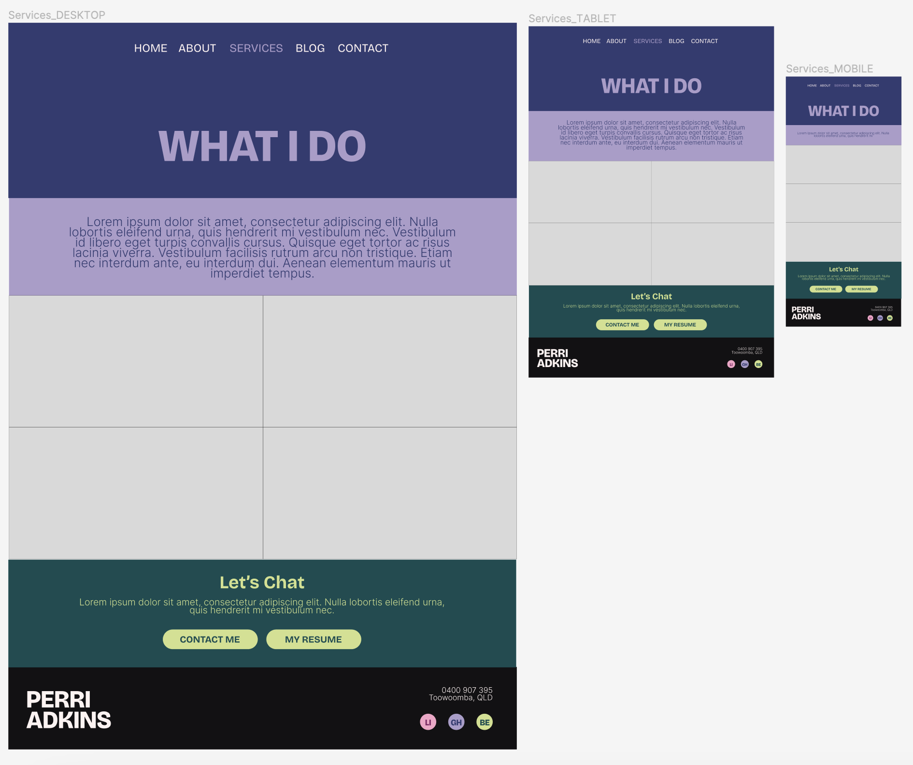
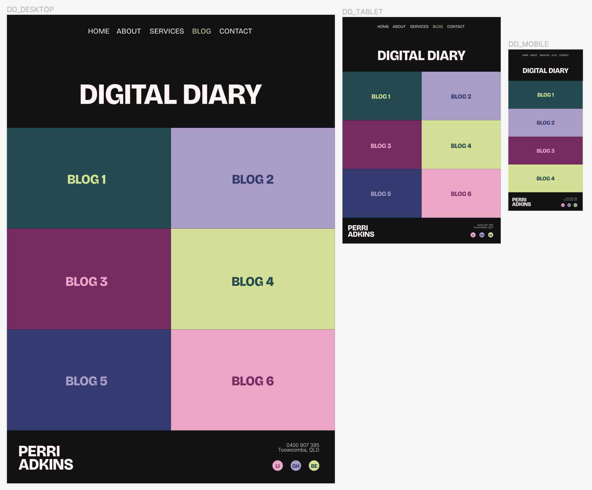
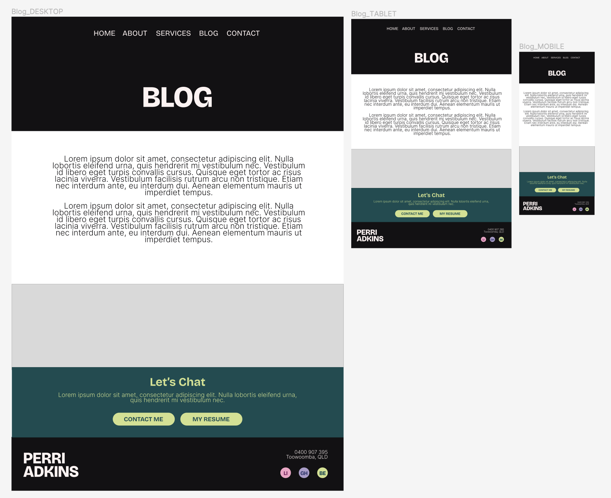
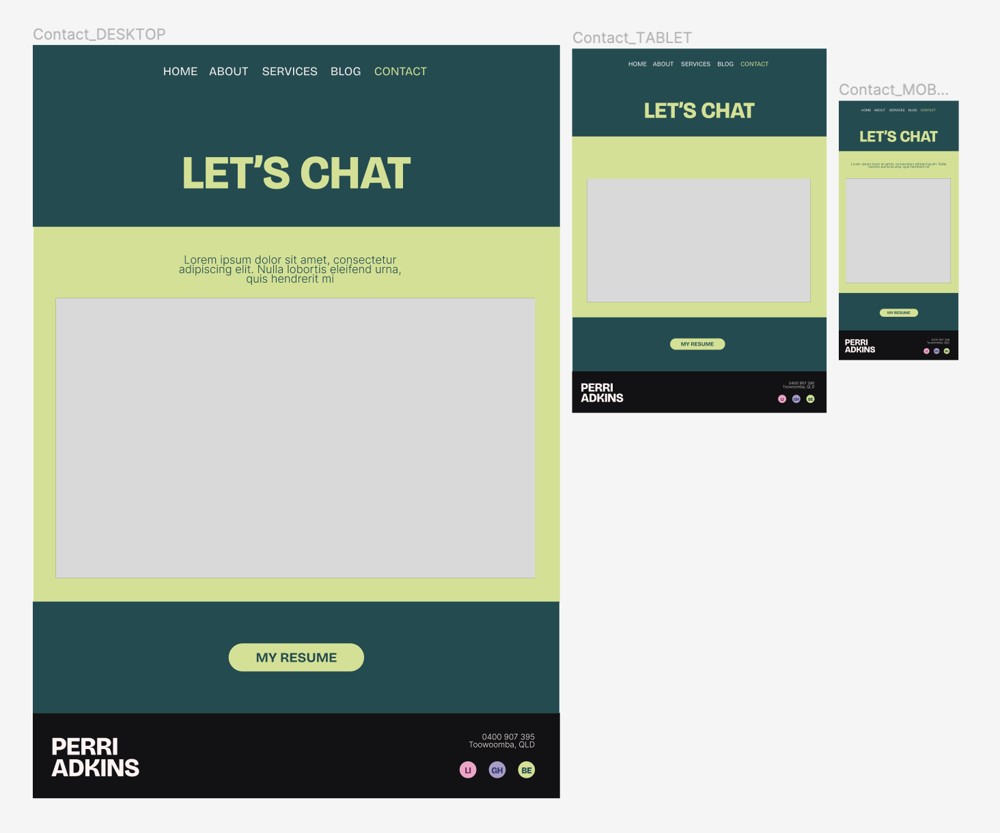

# t1a1_portfolio Perri Adkins

## Site Plan / Map

### Purpose:
To communicate my portfolio clearly and effectively. A simple design that is easy to use, shows information about me, my experience & qualifications, contact details and blog.

### Goals:
- Keep users interacting/interested in site
- Clear call to actions
- Strategic page links that flow well eg. Services -> Contact Me

### Sitemap

## Wireframes

### Home Page

### About Page

### Services Page

### Blog Page (all blogs)

### Blog Post

### Contact Page

## Build Process

### 25/5/24
Created goals and site map for website 
Begin wireframes for website

### 26/5/24
Complete wireframes for website
Create new repo and connect to GitHub
Begin README.md

### 27/5/24
Create index.HTML, index.css and file images
Create mobile header for website (links yet to be added)
Begin styling Home page

### 28/5/24
Complete Mobile (600px), Tablet (728px), Desktop (992px) and Large Desktop (1280px) Home Page
Deploy website for responsiveness testing
Linked social icons
Complete About page design and responsiveness

### 29/5/24
Complete Services page design and responsiveness
Link nav to each page